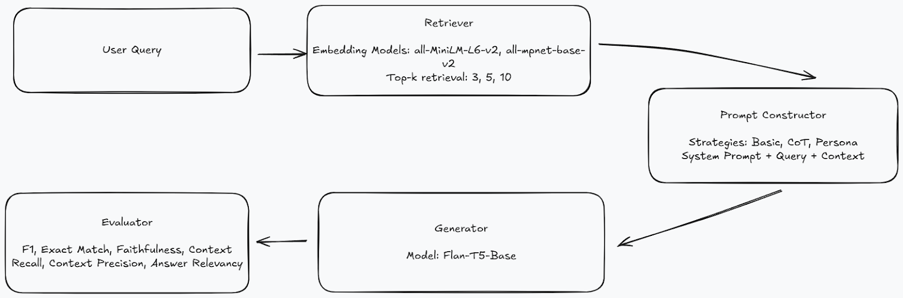
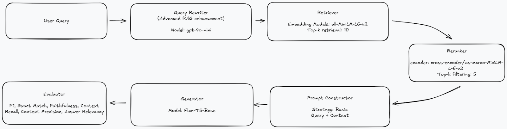

# Retrieval-Augmented Generation Experiments with the RAG-Mini-Wikipedia Dataset

> A comparative study of baseline and advanced RAG architectures using the Mini-Wikipedia dataset, with systematic evaluation of retrieval techniques and generation quality.

## Overview
**Objective:** The goal was to develop practical expertise in Retrieval-Augmented Generation (RAG) systems by implementing a **Naive RAG** baseline and extending it with two **production-ready enhancements**. Both pipelines were evaluated using industry-standard metrics to better understand real-world RAG deployment challenges.


## System Architectures

### Naive RAG Architecture
The Naive RAG pipeline follows the standard retriever–generator–evaluator design. Experiments were conducted across multiple embedding models, prompt strategies, and retrieval depths (*k*).



### Advanced RAG Architecture
The Advanced RAG pipeline builds on the best naive configuration with two enhancements:
1. **Query Rewriting** – to normalize user queries and improve retriever alignment.
2. **Reranking** – using `cross-encoder/ms-marco-MiniLM-L6-v2` to select the most relevant contexts from a larger candidate pool (fetch-10 / select-5).




## Setup

### Prerequisites
- Python 3.8+
- Jupyter Notebook/Colab
- OpenAI API access

### Setup API Key
Since query rewriting and RAGAS uses an OpenAI model, make sure your environment includes:

```bash
export OPENAI_API_KEY="your_api_key_here"
```

## Running the Experiments

### Naive RAG
Open and run all cells in `naive-rag.ipynb` to execute experiments varying:
  - Embedding models (`all-MiniLM-L6-v2`, `all-mpnet-base-v2`)
  - Prompt strategies (basic, persona, CoT)
  - Top-*k* values (3, 5, 10)

Results are saved in the `results/` directory.

#### Processing Results
To combine multiple experiment outputs into a single CSV:
```bash
python scripts/process_results.py
```

### Advanced RAG
Open and run all cells in `advanced-rag.ipynb` to execute the enhanced pipeline with:
  - **Query rewriting** (`gpt-4o-mini`)
  - **Reranking** (`cross-encoder/ms-marco-MiniLM-L6-v2`)
  - **Fetch-10 / Select-5** strategy


## 📊 Results Overview

Best setup → `all-MiniLM-L6-v2 + basic prompt + k=10`
| Metric | Score |
|--------|-------|
| F1 Score | 50.24 |
| Exact Match | 39.65 |
| Faithfulness | 0.92 |
| Context Recall | 0.84 |
| Answer Relevancy | 0.80 |

With query rewriting + reranking (fetch-10 / select-5):
| Metric | Score |
|--------|-------|
| F1 Score | 22.17 |
| Exact Match | 14.5 |
| Faithfulness | 0.78 |
| Context Recall | 0.70 |
| Answer Relevancy | 0.56 |

*Drop in accuracy due to over-aggressive query rewriting, though recall and faithfulness stayed strong.*

For detailed analysis, see **Final Report.pdf**.


## Key Insights

- **Simple often wins:** Basic prompts with good retrieval (k=10) outperformed complex strategies
- **Query rewriting needs tuning:** Aggressive rewriting can distort user intent
- **Faithfulness remains high:** Both pipelines maintained strong factual grounding

## Technologies Used

- **Embeddings:** Sentence Transformers (`all-MiniLM-L6-v2`, `all-mpnet-base-v2`)
- **Reranking:** Cross-Encoder (`ms-marco-MiniLM-L6-v2`)
- **Query Rewriting:** OpenAI GPT-4o-mini
- **Evaluation:** RAGAS, HuggingFace Evaluate
- **Dataset:** RAG-Mini-Wikipedia
